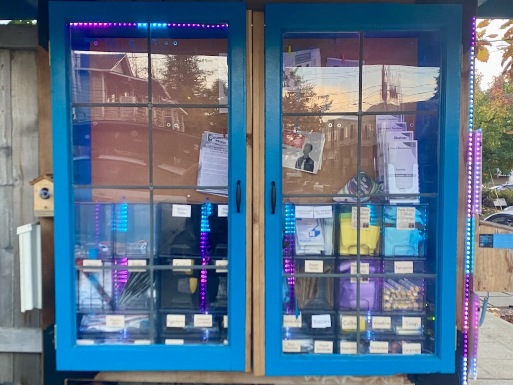
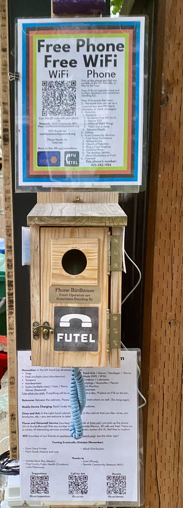

+++
title = 'About'
date = 2024-09-09T21:13:52-07:00
draft = false
+++

* [A Note on What Gets Stocked](#a-note-on-what-gets-stocked)
* [Current Stocking](#current-stocking)
* [Photos](#photos)
* [Thanks](#thanks)

## 7014 42nd Ave S, Seattle, WA 98118

The Little Free Failure of Capitalism (LFFC) is a distribution point for necessities for anyone who needs or wants them. People suffering from houselessness or impoverishment may need things like soap, socks, wound care materials, and similar items. People who are, or who live around, people suffering from opioid addiction may need naloxone (Narcan). People of all stripes may want zines, art, native plant seeds, food plant seeds, or on-demand short stories. People with a need to use a phone, or who are curious what on earth a free public telephone there is doing in 2025 (it is actually a phone! It's just also an art project) may want to use the phone. All of these can be had at the LFFC.

## A Note on What Gets Stocked

At a high level, my goal for the left-hand cabinet is to provide necessities. As a corollary, I want not to duplicate other resources in the neighborhood. For instance, there are a couple of free pantries nearby (as well as a church that does semiweekly food box handouts), and I don't wish to steal their spotlight---food is, of course, absolutely critical. Accordingly, I'm not doing food here. Similarly, there's a (city-provided) needle/sharps collection box at Othello Park, so while that's another great service to provide, I'm not doing it at LFFC.

Planned and hopefully on the LFFC very soon will be a map with pointers to other potentially-useful resources in South Seattle, including free pantries, free fridges, Little Free Libraries, and similar.

## Current Stocking

As of October 31, 2025:

* Supplies:
  * Narcan/Naloxone: boxes of two nasal doses, and tubes with two injectable doses.
  * Masks: KF94 and N95 (Aura) masks.
  * Socks: Crew-length wool-blend thermal-weight socks.
  * Nitrile gloves: what it says on the tin. In bundles of three (two inside one), to keep two very clean even if they fall out of a pocket.
  * Pads (3 bins): Menstrual pads in five sizes/absorbencies. There's a chart on each bin showing the manufacturer-recommended panty size vs absorbency matrix to recommend one of the five. All have wings.
  * Tampons: Tampax "regular" tampons, with cardboard applicators.
  * Toothbrushes/Toothpaste: what it says on the tin.
  * Condom / Lubricant Bin: Condoms (assorted brands, including [Skyn](https://skynfeel.com/) non-latex condoms!), [internal/female condoms](https://fc2condoms.com/),  and lubricant ([Slippery Stuff](https://wallace-ofarrell.com/) water-based taste-free lubricant in convenient single-use sachets).
  * Combine (ABD) pads, Band-Aids, and Non-Adherent Pads: different solutions to cover and protect wounds. (Combine pads have waterproof backs that can't be oozed through, sort of like giant non-adhesive Band-Aids; non-adherent pads, as the name suggests, won't adhere to wounds as they heal, so they can be used for dressings that need to be changed without re-injuring the wound.)
  * CoBan: this is short for COherent BANdages. They're those self-adhesive elastic wraps you often get, for instance, after donating blood. We distribute 3"-wide ones to help hold on complex wound dressings.
  * Vaseline: single-use sachets to help keep wounds moist to promote healing.
  * Soap: small bars of soap.
  * Rain ponchos: disposable rain ponchos.
  * Ibuprofen, sunscreen, and earplugs: a drawer full of small items that fit in the box together.
  * Hand sanitizer: in small sachets.
  * Razors and shaving gel.
  * Pencils and comment sheets: pencils which can be taken, and optional comment cards for people who want to leave a comment or suggestion in the birdhouse to the left.
  * Paper bags: to help contain things, as we give away a lot of small, single-use items that are easy to drop accidentally.
  * In winter: warm (wool-blend) hats and gloves, and pairs of chemical (single-use, disposable) handwarmers.
* Right Edge:
  * [Phone](#phone): This is a phone (it's inside a birdhouse, which is a convenient rain shield). You can dial any number in North America for free. Press 0 to speak with an operator (one of Futel's mottos: "Operators are Sometimes Standing By"). Press # for the menu system, then press 2 for voicemail; anyone can set up a free voice mail box, which others can leave messages at by dialing 503-468-1337 and following the prompts (they'll need your mailbox number). Other numbers lead to other interesting results! (There's a directory below the phone.)
  * There is also a sign speaking a bit about what is in the LFFC at the moment (changing as new things are added).
  * WiFi: We have free WiFi, courtesy of our friends at [ShadyTel](https://shady.tel/). The phone + WiFi combination has been so popular that we've modularized it as the [Connections](/connections) project and started installing it at other sites.
  
There is also a comments ~box~ birdhouse, and provided comments paper (and pencils) so people can submit ideas and suggestions.

## Thanks

* Thanks to [Mask Bloc Seattle](https://linktr.ee/maskblocseattle) for hooking us up with masks to distribute.
* Thanks to [Futel](https://futel.net/) for providing phone service.
* Thanks to the [Washington State Department of Health, Overdose Education and Naloxone Distribution Program](https://doh.wa.gov/you-and-your-family/drug-user-health/overdose-education-naloxone-distribution) for providing naloxone (Narcan) to distribute.
* Thanks to [King County Public Health](https://kingcounty.gov/en/dept/dph/health-safety/disease-illness/hiv-sti-hcv) and their HIV/STI/HCV program for the condoms and lubricants. (It turns out to be difficult to provide a variety of condoms, and in particular, a variety that includes non-latex condoms, unless you can purchase in pallet quantity; they do, and they are kind enough to let us distribute some!)
* Thanks to all the people who have written small notes of encouragement, sent emails to us, or shared information about what we're doing with people in need.

## Coming Soon

## More!

This is what we're building out still; we don't have an ETA yet, but we're working on these.

* Short Story Printer
* Plant Seeds (Native and not)
* eBook Distribution
* More!

## Photos

Photos are current as of late October, 2025, after our rebuild!

### Main

### Phone

