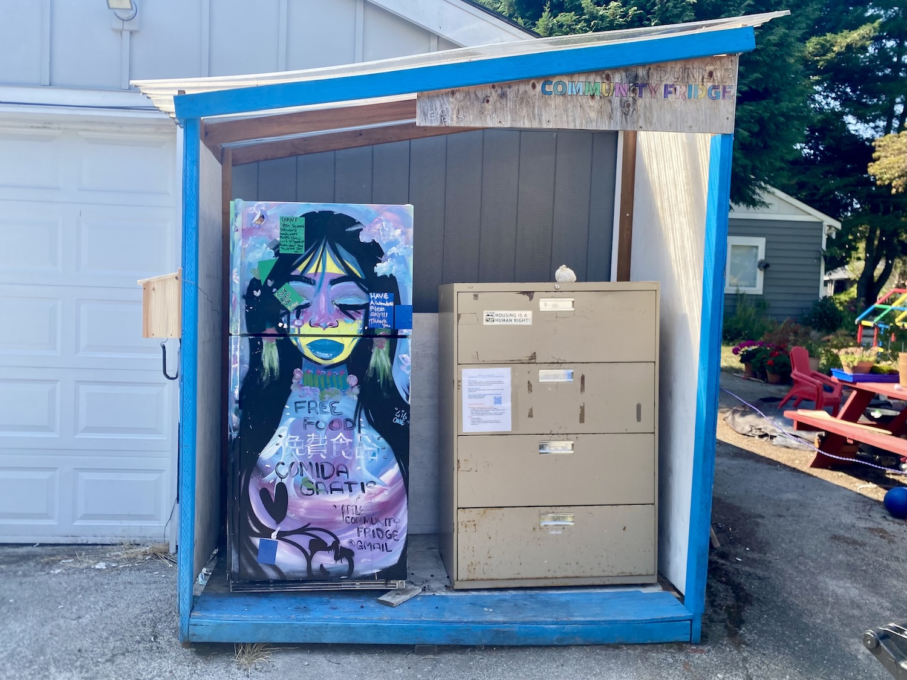
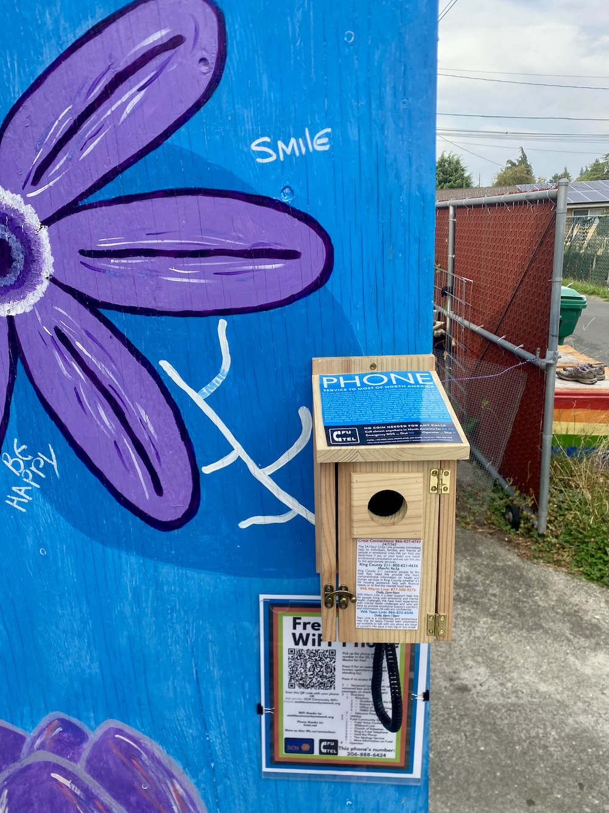
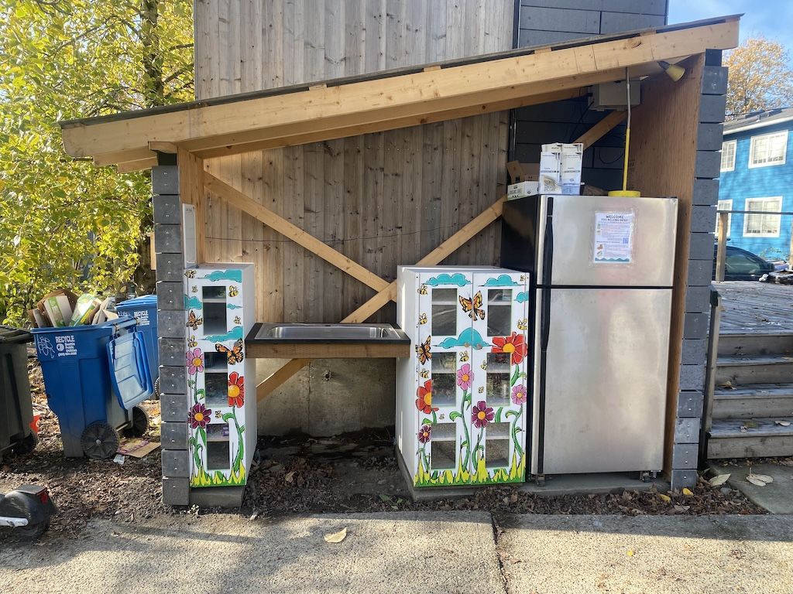
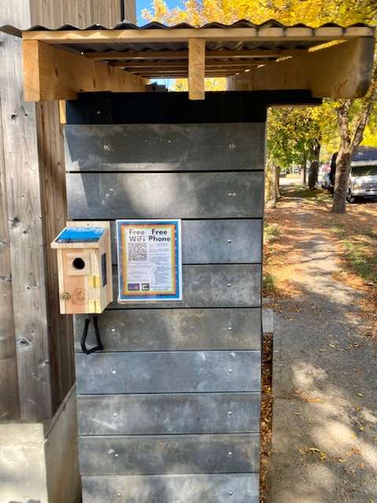

+++
title = 'Connections'
date = 2025-08-05
draft = false
+++

## What?

A Connections node is a small waterproof box with a couple of cables running to it. It provides free landline phone service with an attached phone, courtesy of [Futel](https://futel.net), and free WiFi. Want one for your site? Email <connections@lffc.us>!

I made a [short pitch video](https://www.youtube.com/watch?v=2W2gnzSKg9c) on Connections targeted toward potential site hosts, which may help explain it:

<iframe width="560" height="315" src="https://www.youtube.com/embed/2W2gnzSKg9c" title="YouTube video player" frameborder="0" allow="accelerometer; autoplay; clipboard-write; encrypted-media; gyroscope; picture-in-picture; web-share" referrerpolicy="strict-origin-when-cross-origin" allowfullscreen></iframe>

## Why?

LFFC has had a [Futel](https://futel.net) phone since day one. We're proud to be the first Futel node in Seattle, and we've been overjoyed to see so many people using it to contact friends, relatives, and support systems (shelters, food, medical providers, etc.). In May 2025, a written suggestion came in to LFFC, asking if we could provide WiFi. We immediately wanted to; we're tech people, after all, and we know how to provide guest wifi without having people mess with our other computers, and without risking copyright strikes from our ISP if people do naughty things. We wanted to make that easy for others, too, and with our friends at [ShadyTel](https://shady.tel/)/Northwestern Telephone & Telegraph (NT&T), we're able to provide a WiFi connection that doesn't touch your Internet or mess with your devices, along with a landline phone, anywhere in the city!

While LFFC was the first installed site, with WiFi coming online in July 2025, we've now expanded to Seattle Community Fridge sites in Dunlap and Cherry Hill, and we're looking forward to expanding elsewhere soon!

### Technical Details

We use routers that make [Wireguard](https://en.wikipedia.org/wiki/WireGuard) connections to NT&T and route all guest wifi traffic over that. Our phones use an [ATA](https://en.wikipedia.org/wiki/Analog_telephone_adapter) to talk to Futel's systems, and the same router provides connectivity to them as well as a small computer for maintenance. The underlying traffic runs over your Internet connection, but from the perspective of a user or a server on the Internet, people on the WiFi are "at" NT&T, not your site. All the hardware is locked in a small waterproof box, and the phone lives in a birdhouse to keep the rain off. This has worked well for fourteen months at LFFC, and is going great so far at our newer locations!

## Sites

### Dunlap Seattle Community Fridge

* Address: 48th Ave S & S Thistle St, Seattle WA 98118 (in alley)
* Go-live date: August 29, 2025

### Estelita's Library / Seattle Community Fridge

* Address: 241 Martin Luther King Jr Way S, Seattle, WA 98144
* Go-live date: October 6, 2025

