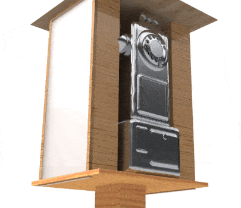

### Important Note: Build-out in Progress

I'm intending to build everything described here, but it's not done yet. Therefore, please take *everything* on this site as "plans" rather than "thing you can touch right now."

## Location

7014 42nd Ave S, Seattle, WA. It's quite close to the Othello station on the [Link 1 Line](https://www.soundtransit.org/ride-with-us/stations/link-light-rail-stations).

## Overview

The Little Free Failure of Capitalism (LFFC to its friends) contains the following components:
* (Some) life necessities for the houseless population: socks, soap, period products for menstruators, etc.
* Maps to nearby Free Pantries and similar resources
* Access to eBooks (via a provided Internet connection, for people with mobile devices)
* Mobile device recharging
* Soil/environment lead testing, and other hazard testing, thanks to our friends at [UW/Stanford LilLabs](https://www.lillabs.org/home)
* Naloxone (for opioid overdose treatment), thanks to our friends at [DOH Overdose Education and Naloxone Distribution (OEND)](https://doh.wa.gov/you-and-your-family/drug-user-health/overdose-education-naloxone-distribution)
* Free phone calls and voicemails (thanks to our friends at [Futel](https://futel.net/about/)), along with a directory of useful numbers (e.g., shelters for houseless and/or abused people)
* Zines of potential interest
* A Short Story Printer
* ...more to come!

## Quick Links to Documents Under Discussion

You may be looking for the following:
* [UW LilLabs Budget - Base](2024-lillabs-base.markdown)
* [UW LilLabs Budget - Air Filtration](2024-lillabs-filters.markdown)

## Rationale

I kept hoping that paying taxes, voting for more taxes, and voting for people who promised to create a *functional* social safety net, quickly, to help people *now*, would help people. It hasn't yet! I'm still doing that, but now I'm doing this too.

## Services Offered

(Work in progress)

